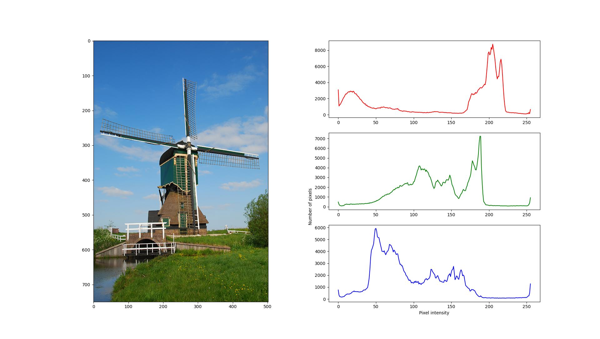

## ImageHist

A simple code to calculate [image histogram](https://en.wikipedia.org/wiki/Image_histogram) and visualize them separately in 3 different plots.

### Usage
For example, the following code takes in the file `./demo.jpg`, calculates its histogram with `DPI=500`, and saves the final histogram plots.
```
python main.py --file_name ./demo.jpg --dpi 500 --save_img
```
Here is the result:
<p align="center"></p>
